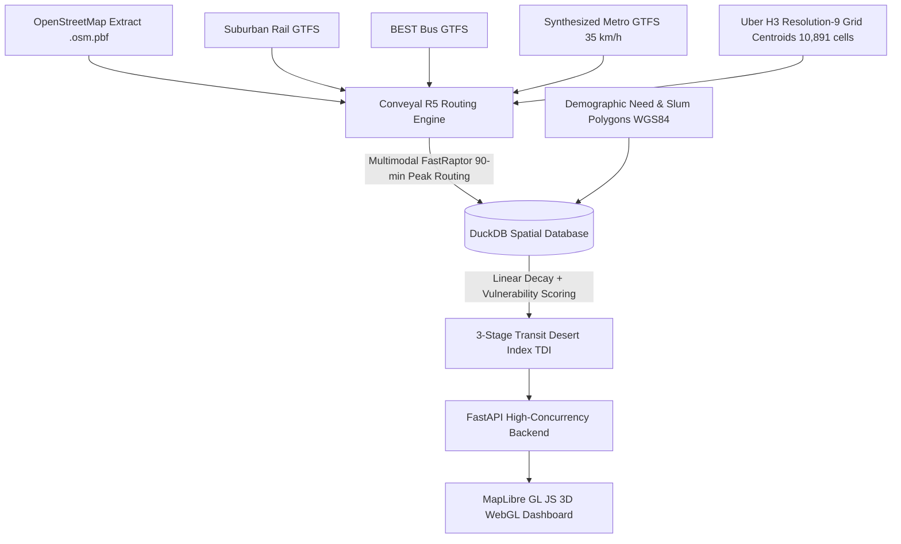

# Mumbai 2030: Multimodal Transit Equity & 3-Stage Metro Evaluation Platform

[](https://fastapi.tiangolo.com)
[](https://duckdb.org)
[](https://h3geo.org)
[](https://r5py.readthedocs.io)
[](https://maplibre.org)
[](LICENSE)

An enterprise spatial data science and multimodal transit simulation engine that evaluates spatial equity, transit desert severity, and transit expansion impact across **Greater Mumbai** (and benchmarked against **Greater Melbourne**).

The platform quantifies how historical suburban rail dominance created chronic spatial transit deserts—particularly for low-income and informal slum settlements—and simulates the equity relief delivered by the **MMRDA 2030 Master Metro Expansion (14 corridors, 177 stations)**.

---

## 🌟 Key Architecture & Capabilities



- **DuckDB Native Spatial Engine:** High-speed analytical joins and spatial intersection operations between H3 hexagons, demographic census polygons, and multimodal travel matrices with zero Postgres/PostGIS overhead.
- **Conveyal R5 FastRaptor Routing:** Java 21-backed multi-modal transit graph routing (Suburban Rail + BEST Buses + Metro Network + Walk transfers) computing travel times across **10,891 H3 Resolution-9 origins** to strategic mega-hubs under strict morning peak constraints.
- **Standardized Uber H3 Hexagonal Grid:** Eliminates boundary distortion and Modifiable Areal Unit Problem (MAUP) using uniform Resolution-9 hexagons (~100m diameter).
- **Informal Settlement & Slum Vulnerability Index:** Weights spatial accessibility against structural vulnerability ($V_i$), identifying informal settlement corridors requiring urgent transit equity interventions.
- **3D WebGL Glassmorphism Explorer:** Responsive MapLibre GL JS interface featuring dynamic 3D hexagonal extrusion layers (`fill-extrusion`), halo station markers, and interactive scenario transitions.

---

## 🔬 3-Stage Chronological Evaluation Methodology

The platform models the urban transit evolution of Mumbai across three distinct operational milestones:

1. **Stage 1: Legacy Network (Without Metro)**
   - *Baseline Transport:* Suburban Railway (Western, Central, Harbour Lines) + BEST Bus network.
   - *Result:* Extreme longitudinal connectivity along rail corridors, but severe lateral east-west transit deserts.
2. **Stage 2: Current Network (Active Metro — 79 Stations)**
   - *Active Feeds:* Line 1 (Blue), Line 2A (Yellow), Line 2B Phase 1 (Mandale–Chembur), Line 3 (Aqua — Cuffe Parade to Aarey), Line 7 (Red), and Line 9 Phase 1 (Dahisar East–Kashigaon).
   - *Impact:* Substantial relief to the Western Express Highway and Andheri–Ghatkopar corridors.
3. **Stage 3: 2030 Full Expansion (177 Stations across 14 Lines)**
   - *Full Network:* Complete buildout of Lines 1 through 12 including Line 4 (Green), Line 5 (Orange), Line 6 (Pink), Line 7A, Line 9 Phase 2, and Line 12.
   - *Impact:* Eliminates transit deserts across Eastern suburbs, Thane, Kalyan, and Navi Mumbai corridors.

### Transit Desert Index (TDI) & Equity Relief Metric ($\Delta\text{TDI}$)

$$\text{TDI}_i = V_i \times (1.0 - A_i)$$

Where:
- $V_i \in [0.0, 1.0]$: Demographic Vulnerability Score (1.0 for informal slum clusters, 0.2 for standard urban fabric).
- $A_i \in [0.0, 1.0]$: Composite Linear Decay Accessibility to destination mega-hubs within a 90-minute commute cutoff:

$$A_i = \frac{1}{K} \sum_{k=1}^K \max\left(0, 1.0 - \frac{T_{i,k}}{T_{\text{max}}}\right)$$

$$\Delta\text{TDI}_{\text{Total}} = \text{TDI}_{\text{Legacy}} - \text{TDI}_{2030}$$

A positive $\Delta\text{TDI}$ quantifies exact spatial disadvantage reduction delivered by transit infrastructure expansion.

---

## 📊 Citywide Simulation Results (Mumbai)

| Evaluation Stage | Active Stations | Mean Accessibility ($A_i$) | Mean TDI | Slum Cluster TDI | Cells Benefiting |
| :--- | :---: | :---: | :---: | :---: | :---: |
| **Stage 1: Legacy (No Metro)** | 0 | **0.2005** | **0.1745** | **0.5522** | Baseline |
| **Stage 2: Active Metro** | 79 | **0.2014** | **0.1743** | **0.5500** | **1,221 cells (11.2%)** |
| **Stage 3: 2030 Full Network** | 177 | **0.2022** | **0.1741** | **0.5493** | **2,204 cells (20.2%)** |

> 📖 **Full Analytical Whitepaper:** For an in-depth breakdown of corridor-by-corridor equity relief, slum cluster accessibility gains, BKC catchment dynamics, and transit policy recommendations, read the complete [**ANALYSIS_REPORT.md**](ANALYSIS_REPORT.md).

---

## 🗄️ Data Sources & Attribution

- **OpenStreetMap:** Road and pedestrian walking networks via Geofabrik / Overpass API.
- **Mumbai Suburban Rail & BEST Bus GTFS:** Official schedule archives standardized to GTFS format.
- **Mumbai Metro Network (KML & Station Geometries):**
  > *Base KML for the Mumbai Metro network was sourced from a Reddit thread by ThatAditya06 (https://www.reddit.com/r/transit/comments/1spulom/complete_mumbai_metro_mmr_network_mapped_in/). The dataset was subsequently modified, rigorously updated, and algorithmically mapped for this project, adding missing under-construction stations, resolving Phase 1/Phase 2 operational statuses, and fixing physical alignments.*
- **Demographic & Slum Boundaries:** Open City Mumbai ward census metrics and verified slum polygon datasets.
- **Greater Melbourne Demographics:** Australian Bureau of Statistics (ABS) 2021 Census SA1 boundaries and SEIFA Index of Relative Socio-economic Disadvantage (IRSD).

---

## 🚀 Installation & Setup

### Prerequisites
- **Python 3.10+ (64-bit)**
- **OpenJDK 21+ (64-bit)** *(Required for `r5py` / Conveyal R5 JVM FastRaptor routing)*
- **RAM:** 16GB+ recommended for multimodal graph compilation

### 1. Clone & Set Up Environment

```bash
git clone https://github.com/SharlEclair/transit-desert-platform.git
cd transit-desert-platform

# Create virtual environment
python -m venv .venv

# Activate virtual environment
# On Windows (PowerShell):
.\.venv\Scripts\Activate.ps1
# On Linux/macOS:
source .venv/bin/activate

# Install dependencies
pip install -r requirements.txt
```

### 2. Configure Environment Variables

Copy the example configuration file:
```bash
cp .env.example .env
```

Edit `.env` to supply your credentials:
```ini
# CartoDB / Map Provider Configuration
CARTO_API_KEY=your_carto_api_key_here
```

### 3. Execute Pipeline Stages

Run the data preparation, GTFS synthesis, matrix routing, and DuckDB view materialization:

```bash
# Step A: Synthesize standard GTFS feeds (35 km/h commercial speed)
python src/mumbai/synthesize_future_gtfs.py

# Step B: Generate standardized spatial GeoJSON layers
python src/mumbai/build_final_geojsons.py

# Step C: Compute Multimodal Travel Matrices via R5 (Active Metro + 2030 Network)
python src/mumbai/compute_travel_matrix.py --scenario current_metro
python src/mumbai/compute_travel_matrix.py --scenario 2030

# Step D: Materialize 3-Stage Equity Views in DuckDB
python src/mumbai/materialize_2030_equity.py
```

### 4. Run the Web Application

Launch the FastAPI backend server:

```bash
python -m uvicorn src.api.main:app --host 127.0.0.1 --port 8000 --reload
```

Open your browser at **`http://127.0.0.1:8000/`** to interact with the 3D Geospatial Explorer.

---

## 📁 Repository Structure

```text
transit-desert-platform/
├── .env.example                     # Environment template
├── .gitignore                       # Git exclusion rules for secrets & heavy binaries
├── LICENSE                          # MIT License
├── README.md                        # Project documentation
├── requirements.txt                 # Python dependencies
├── data/
│   ├── raw/                         # Raw OSM, GTFS, census, and KML data
│   └── processed/                   # DuckDB database, GTFS archives, GeoJSON layers
├── frontend/
│   ├── index.html                   # 3D Dashboard client interface
│   ├── styles.css                   # Glassmorphism aesthetic theme & HUD components
│   └── app.js                       # MapLibre GL JS engine & state orchestrator
└── src/
    ├── api/
    │   ├── main.py                  # FastAPI server & Melbourne endpoints
    │   └── mumbai_router.py         # 3-Stage Mumbai simulation & transit endpoints
    └── mumbai/
        ├── build_final_geojsons.py  # Spatial GeoJSON extractor
        ├── compute_travel_matrix.py # R5 FastRaptor travel time computer
        ├── finalize_kml_mapping.py  # KML v3 station entity resolution
        ├── materialize_2030_equity.py # DuckDB 3-stage equity materializer
        └── synthesize_future_gtfs.py # Bi-directional GTFS synthesizer
```

---

## 📜 License

This project is licensed under the MIT License — see the [LICENSE](LICENSE) file for details.
