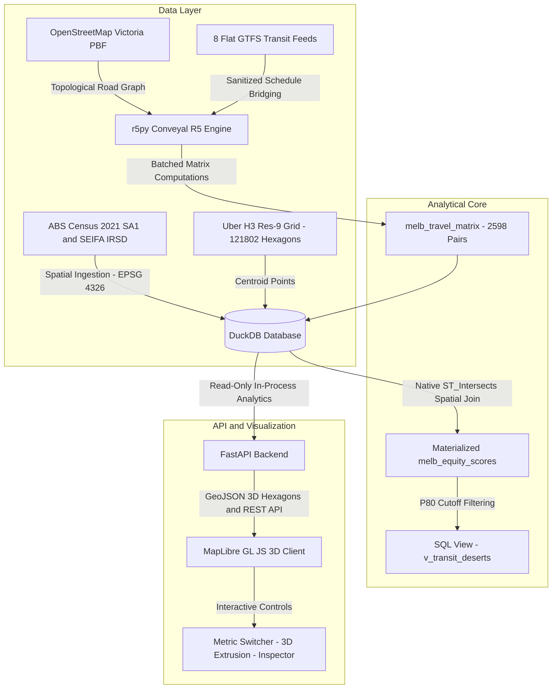

<div align="center">

# 🚆 Melbourne Multimodal Transit Desert & Equity Platform
### *Unmasking the "Transport Illusion" with Dynamic Multimodal Isochrones, DuckDB, `r5py`, and Uber H3*

[](https://fastapi.tiangolo.com)
[](https://duckdb.org)
[](https://r5py.readthedocs.io)
[](https://h3geo.org)
[](https://maplibre.org)
[](https://www.python.org)

</div>

---

## 📌 Executive Summary & The "Transport Illusion"

Traditional urban transit equity audits suffer from the **"Transport Illusion"**: assuming that living within a 500-meter circular buffer of a bus or tram stop guarantees true public transit access. In reality, static buffers ignore:
1. **Timetable Headways & Service Frequencies:** A bus that runs once every 90 minutes is practically inaccessible during commute hours.
2. **Transfer Penalties & Topology:** Geographic proximity means little if crossing suburban railway lines or waterways requires multi-leg detours.
3. **Multimodal Scheduling Synchrony:** Walking speed, platform dwell times, and connection risk govern actual reachability.

This platform replaces naive spatial buffers with **dynamic multimodal travel-time isochrones** computed using Conveyal's `r5py` routing engine (OpenStreetMap street network + 8 unified GTFS transit feeds for Victoria). By overlaying these reachability matrices onto **121,802 Uber H3 Resolution-9 hexagons** and merging with **ABS 2021 Census & SEIFA Socio-Economic Disadvantage data** via DuckDB spatial joins, this project isolates real-world **Transit Deserts** across Greater Melbourne.

---

## 🏛 System Architecture



---

## 📐 Mathematical Formulation

### 1. Multimodal Accessibility Score ($A_i \in [0.0, 1.0]$)
For each H3 hexagon $i$, accessibility is computed using linear decay against a peak 45-minute commute cutoff across strategic employment, healthcare, and education destinations (Royal Melbourne Hospital, Monash University Clayton, Chadstone Shopping Centre):

$$A_i = \frac{1}{N_{\text{poi}}} \sum_{p \in \text{POIs}} \max\left(0.0, 1.0 - \frac{T_{i, p}^{\text{p50}}}{45.0}\right)$$

where $T_{i, p}^{\text{p50}}$ is the median transit travel time in minutes from origin $i$ to destination $p$.

### 2. Demographic Need / Vulnerability Score ($V_i \in [0.0, 1.0]$)
Combines normalized socio-economic disadvantage (ABS SEIFA Index of Relative Socio-economic Disadvantage, which incorporates low household income, zero vehicle ownership, and unemployment) with log-normalized population density:

$$\text{Disadvantage}_i = \frac{1192.0 - S_i}{1192.0 - 266.0}$$

$$\text{Density}_i = \min\left(1.0, \frac{\ln(1 + D_i)}{\ln(1 + 35000)}\right)$$

$$V_i = 0.60 \times \text{Disadvantage}_i + 0.40 \times \text{Density}_i$$

where $S_i$ is the ABS SEIFA IRSD score and $D_i$ is the population density ($\text{people}/\text{km}^2$).

### 3. Transit Desert Index ($\text{TDI}_i \in [0.0, 1.0]$)
A high Transit Desert Index identifies populated communities with high socio-economic vulnerability coupled with near-zero multimodal transit accessibility:

$$\text{TDI}_i = V_i \times (1.0 - A_i)$$

---

## 🛠 Tech Stack

| Layer | Technology | Purpose |
| :--- | :--- | :--- |
| **Spatial Database** | **DuckDB (Spatial Extension)** | Columnar OLAP engine executing native R-Tree `ST_Intersects` centroid joins on 121,802 hexagons in $<1.5$ seconds. |
| **Routing Engine** | **`r5py` (Conveyal R5)** | Java-backed multimodal transit graph compiler combining OSM walking networks with GTFS timetables. |
| **Discrete Spatial Index** | **Uber H3 (Resolution 9)** | Equal-area hexagonal tessellation (~0.1 $\text{km}^2$ per cell) eliminating geographic boundary distortion. |
| **Backend Framework** | **FastAPI + Pydantic** | Asynchronous Python REST API serving GeoJSON features, analytics, and summary statistics. |
| **3D Visualization** | **MapLibre GL JS** | Hardware-accelerated WebGL client with dynamic 3D `fill-extrusion` hexagonal columns and custom color ramps. |

---

## 🚀 Key Engineering Highlights

### 1. Robust Memory-Managed Origin Batching
- Evaluating 121,802 origins against the entire Victoria multimodal transit network causes severe Java heap exhaustion if computed in a single call.
- The pipeline batches origins into **20,000-cell chunks**, forcing explicit garbage collection cycles (`gc.collect()`), JVM pool thread safety (`-Djava.util.concurrent.ForkJoinPool.common.parallelism=1`), and automatic cleanup of temporary `.mapdb` swap files.

### 2. GTFS Sanitization & Timetable Bridging
- Raw Victoria GTFS archives contain empty optional tables (`transfers.txt`, `pathways.txt`) with zero data rows that crash R5's parser.
- Preprocessing scripts automatically validate, sanitize, and repackage feeds into root-level archives, synthesizing `calendar.txt` bridge schedules when feeds rely strictly on `calendar_dates.txt`.

### 3. Native Spatial Joins (Avoiding Boundary Distortion)
- Rather than using H3 polygon polyfilling (which distorts census demographic statistics at precinct edges), exact H3 cell centroids are computed in WGS84 (`EPSG:4326`) and joined via DuckDB's native R-Tree operator (`ST_Intersects`).

### 4. Interactive 3D Web Application
- **Dynamic 3D Hexagon Extrusion:** Visualizes all 12,959 priority transit desert cells as 3D pillars whose heights and continuous colors update in real time based on user-selected metrics ($TDI$, $V_i$, or $A_i$).
- **Priority Suburbs Leaderboard:** Features one-click camera fly-to animations with smooth pitch and bearing adjustments.
- **Hexagon Inspector:** Deep-dive modal revealing exact SA1 code, SEIFA decile, density, and travel time breakdown to major hubs.

---

## 📦 Setup & Installation Guide

### Prerequisites
- **Python:** Version 3.10, 3.11, or 3.12
- **Java Runtime:** **OpenJDK 21+ (64-bit)** (Required for `r5py` / Conveyal R5 JVM bindings)
- **RAM:** 16GB+ recommended for building the Victoria-wide multimodal transit network graph.

### 1. Clone & Set Up Environment
```bash
git clone https://github.com/SharlEclair/transit-desert-platform.git
cd transit-desert-platform

# Create virtual environment
python -m venv .venv
source .venv/bin/activate  # On Windows: .\.venv\Scripts\activate

# Install dependencies
pip install -r requirements.txt
```

### 2. Configure Java 21 Home
Ensure `JAVA_HOME` points to your 64-bit JDK 21 installation:
```bash
# Windows PowerShell example:
$env:JAVA_HOME = "C:\Users\YourUser\.jdk\jdk-21.0.6+7"
```

### 3. Data Directory Structure
Place raw input datasets in `data/raw/`:
```text
data/
├── raw/
│   ├── osm/
│   │   └── victoria-latest.osm.pbf                   # Geofabrik Victoria OSM extract
│   ├── gtfs/
│   │   └── gtfs.zip                                  # PTV Victoria GTFS master archive
│   ├── SA1_2021_AUST_SHP_GDA2020/
│   │   └── SA1_2021_AUST_GDA2020.shp                 # ABS SA1 Boundaries Shapefile
│   └── Statistical Area Level 1, Indexes, SEIFA 2021.xlsx  # ABS SEIFA 2021 Excel
└── processed/
    └── transit_equity.db                             # Generated DuckDB Database
```

---

## ⚡ Execution Pipeline

Execute the end-to-end data engineering and scoring pipeline in sequence:

```bash
# 1. Initialize DuckDB schema
python src/init_db.py

# 2. Ingest ABS Census SA1 and SEIFA Demographics (Transformed to EPSG:4326)
python src/ingest_demographics.py

# 3. Generate 121,802 H3 Resolution-9 Hexagons over Greater Melbourne
python src/generate_h3_grid.py

# 4. Preprocess and unpack PTV GTFS sub-feeds
python src/preprocess_gtfs.py

# 5. Compute Multimodal Travel Matrix using r5py (Batching 121,802 origins)
python src/compute_travel_matrix.py

# 6. Perform Spatial Joins & Materialize melb_equity_scores and v_transit_deserts
python src/compute_equity_scores.py
```

---

## 🌐 Launching the 3D Web Application

Start the FastAPI server:
```bash
python -m uvicorn src.api.main:app --host 127.0.0.1 --port 8000
```
Open **[http://127.0.0.1:8000/](http://127.0.0.1:8000/)** in your browser to explore the interactive 3D platform.

---

## 📊 Analytical Findings: Melbourne's Top Transit Deserts

Aggregation of the top 20th percentile ($TDI \ge 0.3447$) reveals severe public transit deficits in Melbourne's outer northern, western, and south-eastern corridors:

| Rank | Suburb / Precinct | Desert Hexes | Resident Population | SEIFA Decile | Avg Access ($A_i$) | Avg Vulnerability ($V_i$) | Avg TDI |
| :---: | :--- | :---: | :---: | :---: | :---: | :---: | :---: |
| **#1** | **Dandenong - South** | 16 | 8,486 | 1.2 | `0.000` | `0.576` | **0.576** |
| **#2** | **Meadow Heights** | 38 | 20,278 | 1.1 | `0.000` | `0.557` | **0.557** |
| **#3** | **St Albans - North** | 53 | 25,091 | 1.1 | `0.003` | `0.547` | **0.545** |
| **#4** | **Kings Park (Vic.)** | 37 | 16,004 | 1.1 | `0.000` | `0.542` | **0.542** |
| **#5** | **Laverton** | 105 | 27,444 | 2.5 | `0.000` | `0.541` | **0.541** |
| **#6** | **Doveton** | 35 | 19,124 | 1.1 | `0.000` | `0.537` | **0.537** |
| **#7** | **Noble Park - West** | 40 | 23,550 | 1.3 | `0.009` | `0.538` | **0.534** |
| **#8** | **Roxburgh Park - North** | 28 | 13,494 | 1.4 | `0.000` | `0.534` | **0.534** |
| **#9** | **Broadmeadows** | 64 | 31,171 | 1.1 | `0.000` | `0.528` | **0.528** |
| **#10** | **St Albans - South** | 51 | 29,735 | 1.3 | `0.009` | `0.532` | **0.528** |

---

## 📄 License & Attribution
- Data sources: Australian Bureau of Statistics (ABS Census 2021, SEIFA 2021), Public Transport Victoria (PTV GTFS), OpenStreetMap contributors.
- Licensed under the **MIT License**.
